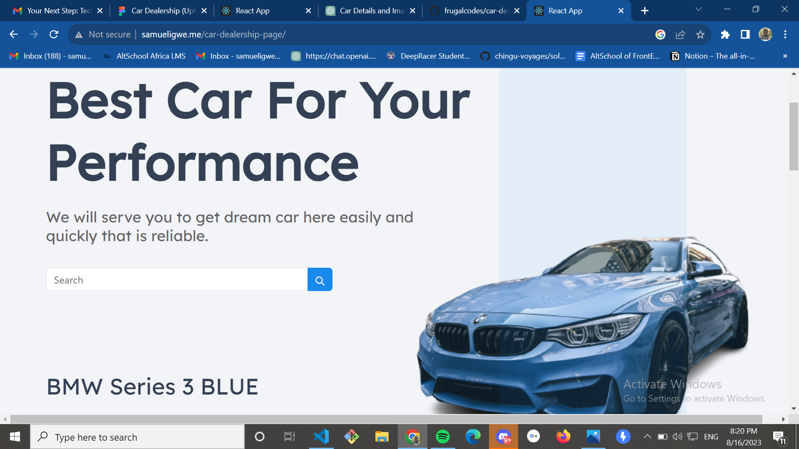

# Car Dealership Web Page

## Project Description

The project is aimed at creating a responsive web page based on a design provided in a Figma file. The primary purpose of this exercise is to assess the ability to translate design concepts into a functional web interface using React. The completed web page should closely align with the design and effectively adapt to various device sizes, ensuring a consistent user experience. Through this project, proficiency in web development, responsive design, and utilization of front-end frameworks will be evaluated.

## Table of Contents

- [Project Overview](#project-overview)
- [Screenshots](#screenshots)
- [Technologies Used](#technologies-used)
- [Setup and Installation](#setup-and-installation)
- [Usage](#usage)
- [Responsive Design](#responsive-design)
- [Contributing](#contributing)
- [License](#license)
- [Contact](#contact)

## Project Overview

This project aims to closely align with the design provided in the Figma file. It demonstrates the ability to transform design concepts into a functional web interface using React. The web page should be responsive and compatible across various devices.

## Screenshots

## Technologies Used

- React
- Bootstrap
- Figma (for design reference)
- GitHub Pages (for hosting)

## Setup and Installation

1. Clone the repository to your local machine.
2. Navigate to the project directory: `cd project-directory`.
3. Install dependencies: `npm install` or `yarn install`.

## Usage

1. Start the development server: `npm start` or `yarn start`.
2. Open your web browser and navigate to `http://localhost:3000` (or the port specified).
3. Explore the web page and its functionalities.

## Responsive Design

This web page has been designed with responsiveness in mind, ensuring optimal display on various devices and screen sizes. The use of Bootstrap (if applicable) helps maintain a consistent and user-friendly experience across different platforms.

## Contributing

Contributions are welcome! If you find any issues or want to enhance the project, feel free to submit a pull request. Please ensure that your code adheres to the project's coding standards.

## License

This project is licensed under the [MIT License](LICENSE).

## Contact

If you have any questions or suggestions, please feel free to contact [Samuel Igwe](mailto:samueligwe63@gmail.com).
